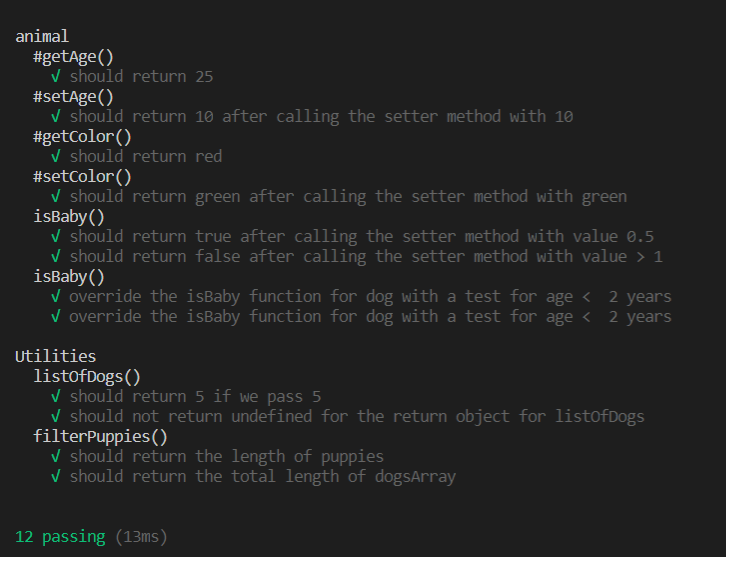

# jstest2

## Table of Contents

- [About](#about)
- [Getting Started](#getting_started)
- [Usage](#usage)
- [Results](#results)

## About <a name = "about"></a>

## Create a class animals in new project JavaTest2

a) add a property for age to animals

b) Make dogs a subclass of animals with property colour.

c) Encapsulate the properties and create/generate getter and setter methods

d) generate unit tests

e) add a function to animals that tests for isBaby (age <  1 year).  

f) override the isBaby function for dog with a test for age <  2 years

g) create a list of dogs

h) filter list for puppies

## Getting Started <a name = "getting_started"></a>

These instructions will get you a copy of the project up and running on your local machine for development and testing purposes. 

### Prerequisites

This project was created with 

```
NodeJS v12.18.1
npm v6.14.5
mocha v8.1.1 (for testing)
```

### Description

This project creates Animal class with age as a private property and its getter and setter methods. Also an isBaby method to evaluate whether the Animal is a baby.

This also extends the Animals class to create a Dogs Class to have color property with its getter and setter methods and overrides the isBaby method for dogs.

This test driven development is using mocha framework for unit testing.

It implements two functions 

```
listOfDogs - to generate a list of dogs array as per the input 
```

```
filterPuppies - filter the dogs array into puppies array and elder dogs array
```

These functions are written in utilities files and have a corresponding test file with appropriate unit tests. 

## Usage <a name = "usage"></a>

```
test -> npm test
```

npm test runs unit tests for both animal.js and utilies.js

## Results <a name = "results"></a>

<p align="center">
  <a href="" rel="noopener">
 </a>
</p>
